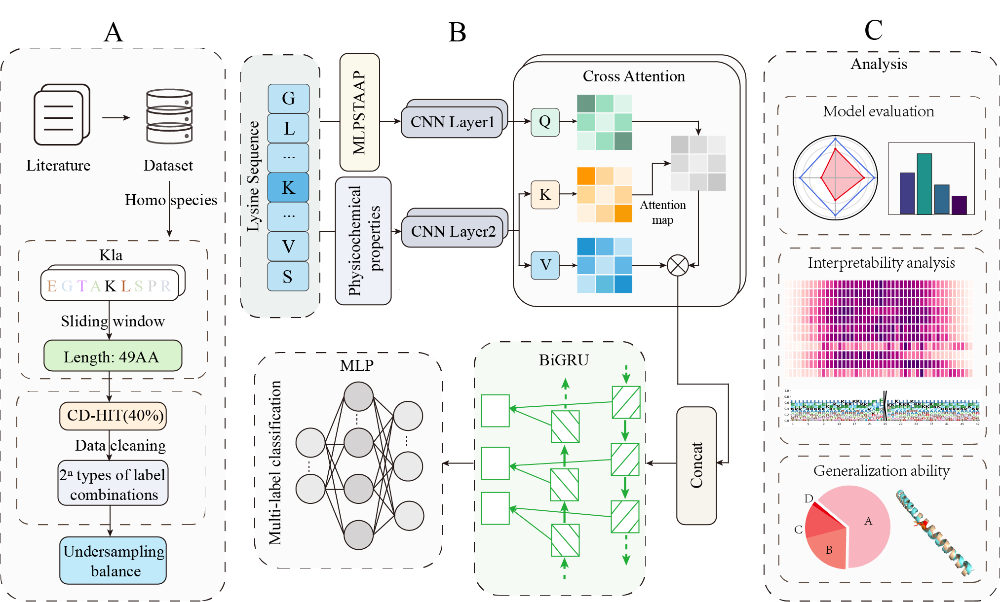

# **OmniK-PTM: A deep learning framework that simultaneously predicts multiple lysine protein post-translational modifications through cross-scale feature fusion**
   
OmniK-PTM is an innovative deep learning framework designed to simultaneously predict multiple lysine protein post-translational modifications (PTMs). By integrating protein sequence information with the physicochemical properties of amino acids and leveraging a state-of-the-art deep learning architecture, OmniK-PTM effectively addresses key challenges in PTM analysis, such as PTM crosstalk and data imbalance.
## **Abstract**
The simultaneous prediction of multiple lysine post-translational modifications (PTMs) is crucial for understanding protein function and disease, yet this task faces challenges such as PTM crosstalk and data imbalance. To address these issues, this study proposes a novel deep learning framework named OmniK-PTM. The framework constructs a more comprehensive feature representation by combining protein sequence information with the physicochemical properties of amino acids. At its core, the framework utilizes a cross-attention mechanism to capture the complex interactions between different feature representations, integrated with a CNN-BiGRU architecture to capture multi-scale patterns and long-range dependencies within the sequence. Furthermore, a novel adaptive clustering undersampling algorithm was designed to mitigate the long-tail distribution problem in PTM data. Evaluations on the test dataset demonstrate that DeepKMulti outperforms other models in predicting classical PTM types and also shows strong predictive capability for emerging PTM types. More importantly, the model exhibits excellent cross-species generalization, successfully distinguishing modification sites in mouse proteins despite being trained exclusively on human data. Through interpretability analyses such as saliency maps and feature visualization, our model reveals key sequences critical for modification types, providing valuable insights into the complex regulatory mechanisms of lysine modification. OmniK-PTM is accessible at **https://huggingface.co/spaces/Xianfish9/OmniK-PTM.**

## **✨ Key Features**
Comprehensive Feature Fusion: Constructs a rich feature representation by combining protein sequence information with the physicochemical properties of amino acids.
Advanced Model Architecture: Employs a cross-attention mechanism integrated with a CNN-BiGRU architecture to effectively capture complex patterns and long-range dependencies.
Handles Data Imbalance: Introduces a novel adaptive clustering undersampling algorithm to effectively address the long-tail distribution common in PTM data.
Superior Predictive Performance: Outperforms existing models in predicting both classical and emerging PTM types.
Excellent Generalization: Demonstrates strong cross-species generalization by accurately predicting modification sites in mouse proteins after being trained exclusively on human data.
Model Interpretability: Provides insights into the decision-making process through saliency maps and feature visualization, highlighting key sequences critical for modification types.
## **🚀 Live Demo**
You can try OmniK-PTM directly in your browser using our online demo hosted on Hugging Face Spaces:
Try DeepKMulti Now!
## **📂 Project Structure**
Code  
OmniK-PTM/  
├── dataset/                  # Folder for datasets  
├── model/                # Python scripts defining the model architecture  
├── Resample/           # Several sampling methods  
├── Feature_extraction_algorithms/                 # Feature encoding   
├── main.py               # Script for training the model   
└── train.py       # Set up the training process   
## **📜 License**
This project is licensed under the MIT License.
## **📧 Contact**
For any questions or inquiries, please open an issue or contact us.
